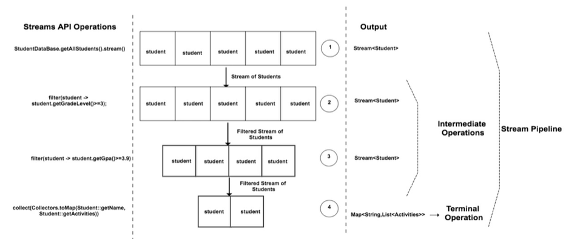

# Section 10: Streams API

## Introduction to Streams API

- Introduced as part of **Java8**
- Main purpose is to perform some **Operation on Collections**
- **Parallel operations** are easy to perform with Streams API without having to spawn multiple threads
- Streams API can be also used with arrays or any kind of I/O

---

## What is a Stream?

- Stream is a sequence of elements which can be created out of a collections such as **List or Arrays** or any kind of **I/O** resources and etc.,

```java
List<String> names = Arrays.asList("adam", "dan", "jenny");
names.stream(); // creates a stream
```

- Stream operations can be performed either **sequentially** or **parallel**

```java
names.parallelStream();
```

---

## How Stream API Works?

Collect starts the pipeline and creates the output



---

## Collections and Streams

Eagerly vs lazily constructed
- You have to populate the collection, the values, if you want to manipulate it

| Collections | Streams |
| ----------  | ------- |
| Can add or modify elements at any point of time | Cannot add or modify elements in the stream. It is a fixed data set |
| Elements in the collection can be accessed in any order. User appropriate methods based on the collection. For Example `List->list.get(4);` | Elements in the Stream can be accessed only in sequence. |
| Collection is eagerly constructed | Streams are lazily constructed |
| Collection can be traversed "n" number of times | Streams can be traversed only once |
| Performs **External Iteration** to iterate through the elements. | Performs **Internal Iteration** to iterate through the elements. |

---


